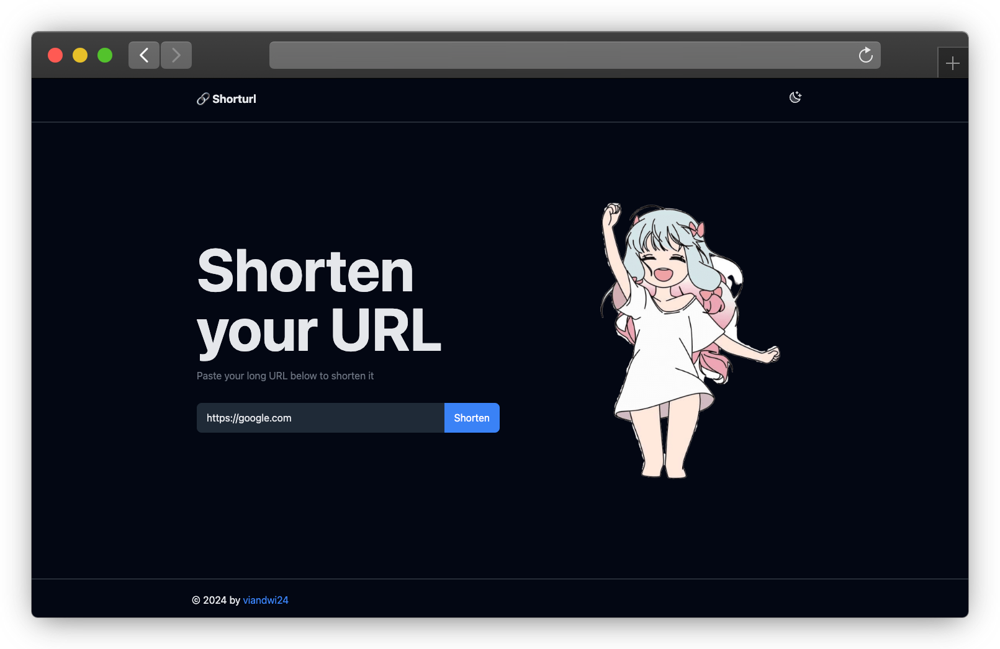

# 🔗 shorturl
Shorturl is a simple URL shortener service that allows you to shorten your long URL into a short one.

<!-- image -->

## Features
- Generate short URL from your long URL
- [Soon] Advanced options
  - Custom short URL
  - Password protection

## Tech Stack
- Frontend: [Svelte](https://svelte.dev/)
- Backend: [Nestjs](https://nestjs.com/)
- Database: [PostgreSQL](https://www.postgresql.org)
- Development Tools: [Docker](https://www.docker.com)